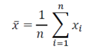
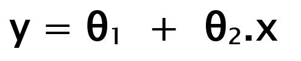
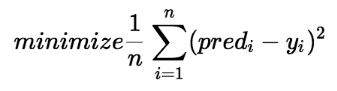

# ML_regression_model
This is a model that we are building on top of NUMPY , PANDAS and  MATPLOTlib 

 # The Math behind solving a regression problem
 lets take a look in the theory and the defrent equision that will help as solve a regression problem in multidimentional space
### **The first thing to do is to get our data :**
* Using pandas funtion ``read_csv('PATH_TO_DATA_SET')`` , this will 
convert the ` .csv ` file to  `Pandas Object ` ; witch is n*m matrix . 
* Now that we have our data set ready to use lets store our `depandent and independent features` as a `numpy arrays ` so that we could use the power of numpy spacially in matrices multiplication.

* Note that the data need to be corilent , we dont need one feature to be in ranges from `1 - 100` and an other feature to be in ranges from  `1000 -1000000`

#### Data normalasation  : 

> using the `mean()` function  
  and the `std()` function  function from Pandas. 

## Solving our regresstion problem 
if we plot our data we will se that its a regression problem 

> **Regression** : predecting continuous values.

Supose that our Y in function of X is 

While :  
**x:** input training data  
**y:** labels to data `we are dealing with a (supervised learning)` 

**θ0:** intercept 
**θ1:** coefficient of x 

**So How to update θ0 and θ1 values to get the best fit line ?**

if we give some value to θ0 & θ1 than we call the new equation `Y_predict` than our Cost function will be  the average squared difference between the actual values and the predicted values (`Y_predect`)  , 

than we should keep updating our `thetas` to reach the best values that minimize the error between `Y_predict` value (pred) and true `Y` value (y). 

to reach this minmam we use one of the known algorithms sach 
the **Gradient descent algorithm**.

### Gradient Descent : 
The idea is to start with random θ0 and θ1 values and then iteratively updating the values,intel reaching the minimum cost.

While **h(x)** is our `Y_predict` 
**alpha** is the learning rate 

>**Note :** the values of thetas after convergence are in the normalised space .
#### Lets get the real coeffision and intercept `(thetas)`
To do this wi will need to invert the normalisation equiation , the figure bellow shows the theorical dimenstration 

### Working with  multidimensional data set : 
