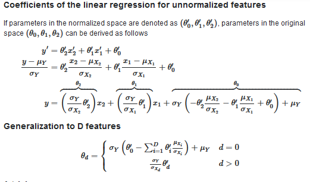

# ML_regression_model
This is a model that we are building on top of NUMPY , PANDAS and  MATPLOTlib 

 # The Math behind solving a regression problems 
 lets take a look in the theory and the defrent equision that will help as solve a regression problem in multidimentional space
### The first thing to do is to get our data set 
* Using pandas funtion ``read_csv('PATH_TO_DATA_SET')`` , this will 
convert the ` .csv ` file to  `Pandas Object ` ; witch is n*m matrix . 
* Now that we have our data set ready to use lets store our `depandent and independent features` as a `numpy arrays ` so that we could use the power of numpy spacially in matrices multiplication.

* Note that the data need to be corilent , we dont need one feature to be in ranges from `1 - 100` and an other feature to be in ranges from  
$10^{2}$ 

### Lets get the real coeffision and intercept 
to do this wi will need to invert the normalisation equiation , the figure bellow shows the theorical dimenstration 

